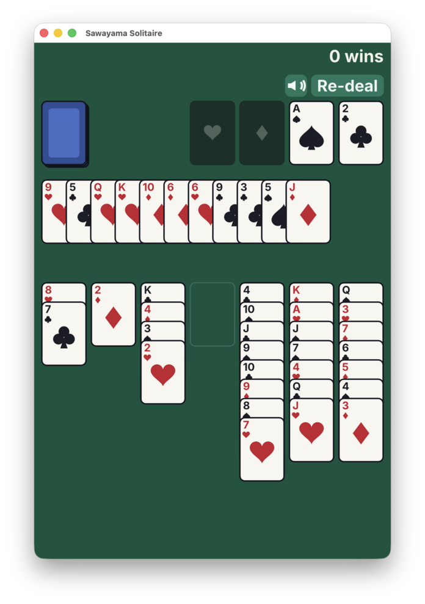

# Sawayama Solitaire

A clone of Zachtronics' **Sawayama Solitaire** (the single-pass Klondike variant
from *Last Call BBS*), built in C++20 with SDL3. It runs natively on desktop and
on the web as an installable PWA. Rendering is procedural (no image assets) and
sound effects are synthesized at runtime, so SDL3 is the only third-party
library; text uses the bundled single-header [`stb_truetype`](third_party/stb_truetype.h)
with a small embedded **Inter** subset (SIL OFL 1.1 — see [assets/](assets/README.md)).

[**Play Solitaire on your browser**](https://nullprogram.com/solitaire/)



See [docs/sawayama-solitaire.md](docs/sawayama-solitaire.md) for the full rules.

## How to play

- All tableau cards are face up. Build columns **down in alternating colors**.
- Drag a card or an ordered run onto another column; **any** card or run may go
  into an empty column.
- Click the stock to **draw three** at a time — there is only **one pass**, no
  reset. When the stock runs out, that slot becomes a single **free cell**.
- Cards advance to the foundations automatically (a conservative auto-mover);
  **double-click** a card to force it up.
- **RE-DEAL** starts a new (always winnable) game at any time. The speaker icon
  toggles sound. Lifetime wins are shown top-right and persisted.

## Winnable deals

Every deal the game presents is **guaranteed solvable**. Roughly a quarter of
random Sawayama layouts are unwinnable from the start, which isn't much fun, so
deals are drawn from a pre-computed pool of seeds that an exhaustive solver proved
winnable (`src/pool_data.h`, a compact bitmap). The deal RNG is
**xoshiro256\*\*** seeded via splitmix64 with an integer-only Fisher–Yates
shuffle, so a given seed reproduces a byte-identical deal on every platform — which
is exactly what lets a seed proven winnable by the native solver reproduce that
same winnable deal in the wasm build.

The solver (`tools/solver.cpp`, native-only, built alongside the game) doubles as a
Monte-Carlo winnability estimator. To regenerate the pool:

```sh
cmake --build build --target solver
# scan seeds [0, --bits) at a per-deal node budget; rewrite the bitmap header
./build/solver --genpool --bits 131072 --budget 2000000 --threads 16 --out src/pool_data.h
cmake --build build   # rebuild the game against the new pool
```

A higher `--budget` proves more of the harder deals winnable (less selection bias
toward easy deals) at the cost of generation time; `--bits` sets the seed range
scanned. Without `--genpool`, the solver runs the Monte-Carlo estimate instead
(`--deals N --budget B --threads T`).

## Build — native

Requires CMake ≥ 3.24 and a C++20 compiler. SDL3 is fetched automatically over
HTTPS (pinned by SHA256) and linked statically.

```sh
cmake -B build -DCMAKE_BUILD_TYPE=Release
cmake --build build
./build/solitaire
```

## Build — web (Emscripten)

Requires the Emscripten SDK (`emcc` on PATH).

```sh
emcmake cmake -B build-web -DCMAKE_BUILD_TYPE=Release
cmake --build build-web
# serve the output (a service worker requires http://, not file://)
python3 -m http.server -d build-web 8000
# open http://localhost:8000/index.html
```

The build emits `index.html` / `index.js` / `index.wasm` plus the PWA support
files (`manifest.webmanifest`, `sw.js`, icons), so the page is installable and
works offline after the first load. The service worker's cache name is stamped
with a hash of the wasm at build time, so each deploy supersedes the old cache.

To deploy, install the complete site to any static HTTPS host (e.g. a GitHub
Pages worktree):

```sh
cmake --install build-web --prefix /path/to/gh-pages-worktree
```

This copies the seven deployable files (including the stamped `sw.js`) into the
prefix; all asset paths are relative, so subdirectory hosting works too.

## Licenses

This project's own code is released into the public domain (see `UNLICENSE`).
It bundles the following third-party components, whose licenses must accompany
binary distributions:

- **SDL3** — zlib license (statically linked). <https://www.libsdl.org/>
- **Inter** (embedded font subset, `src/font_data.h`) — SIL Open Font License
  1.1. Copyright The Inter Project Authors. Full text in
  `assets/Inter-LICENSE.txt`.
- **stb_truetype** (`third_party/stb_truetype.h`) — public domain.

The rules and presentation reimplement *Sawayama Solitaire* by Zachtronics; this
is an independent fan project and is not affiliated with or endorsed by them.
